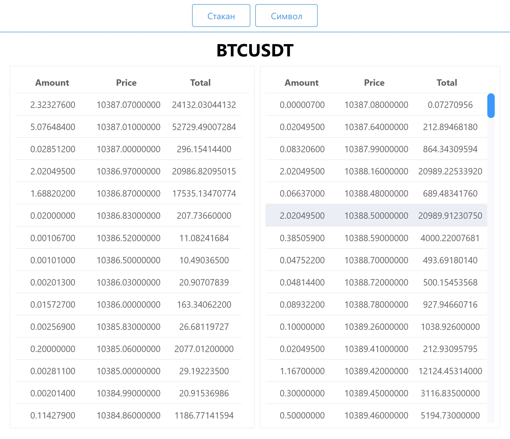
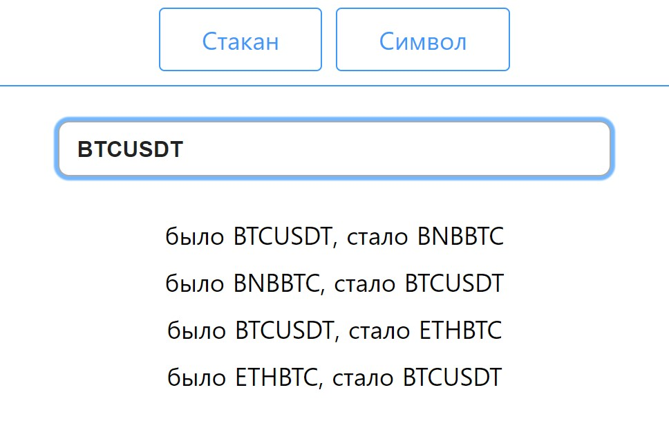

# binance-ticks

Приложение на NuxtJs и VueJs, которое при помощи WebSocket скачивает тиковые данные с криптовалютной биржы Binance в реальном времени, и выводит их на экран.

Шина данных реализованна с помощью фреймворка Vuex. 

SDK для взимодействия с биржей binance представлен двумя функциями Vuex:

- подписываемся на обновления стакана по WebSocket
```javascript
await this.$store.dispatch('store/subscribe', {sym: 'BTCUSDT', fn: function(ticks){}})
```
- получаем биржевой стакан по определенному символу по REST
```javascript
await this.$store.dispatch('store/download', 'BTCUSDT')
```

## Online **[DEMO](https://binance-ticks.herokuapp.com)**

### Вывод данных: bids / asks



### Выбор тикера и логирование изменений



## Build Setup

```bash
# install dependencies
$ npm install

# serve with hot reload at localhost:3000
$ npm run dev
```